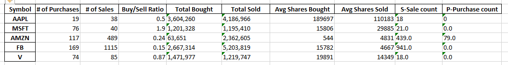

# Insider-Trading
This program extracts insider trading data from the sec website and stores it in excel file for the specified time frame.

Using:
Enter a ticker (ex: 'AAPL, MSFT') or type 'all' to search thru all the tickers in file:\
Here you can enter either single ticker or separate multiple tickers by comma or type 'all' to go thru all the tickers in fName = 'ticker and cik.csv' (default name)

Enter the starting date (Ex: 2020-MM-DD): # enter date in this format no error checking implemented

Would you like to extract data to excel file (Press enter for no OR enter filename):\
Here either enter file name or press enter if you don't want to save the data. By default the program doesn't display any data on shell, but you can add print(all_df) or print(symbol_df) to print the data

# Sample run
Enter a ticker (ex: 'AAPL, MSFT') or type 'all' to search thru all the tickers in file: aapl, msft, amzn, fb, v\
Enter the starting date (Ex: 2020-MM-DD): 2020-05-05\
Would you like to extract data to excel file (Press enter for no OR enter filename): five

Finished extracting AAPL insider data from 2020-05-05 till 2021-01-07.\
Finished: 1/5 symbols.\
Finished extracting MSFT insider data from 2020-05-05 till 2021-01-07.\
Finished: 2/5 symbols.\
Finished extracting AMZN insider data from 2020-05-05 till 2021-01-07.\
Finished: 3/5 symbols.\
Finished extracting FB insider data from 2020-05-05 till 2021-01-07.\
Finished: 4/5 symbols.\
Finished extracting V insider data from 2020-05-05 till 2021-01-07.\
Finished: 5/5 symbols.\
Extracted the data to five.xlsx

# Transaction type
P - Open market or private purchase of non-derivative or derivative security\
S - Open market or private sale of non-derivative or derivative security

ticker and cik.csv source: https://www.sec.gov/include/ticker.txt \
Transaction types: https://www.sec.gov/opa/column-descriptions.html

